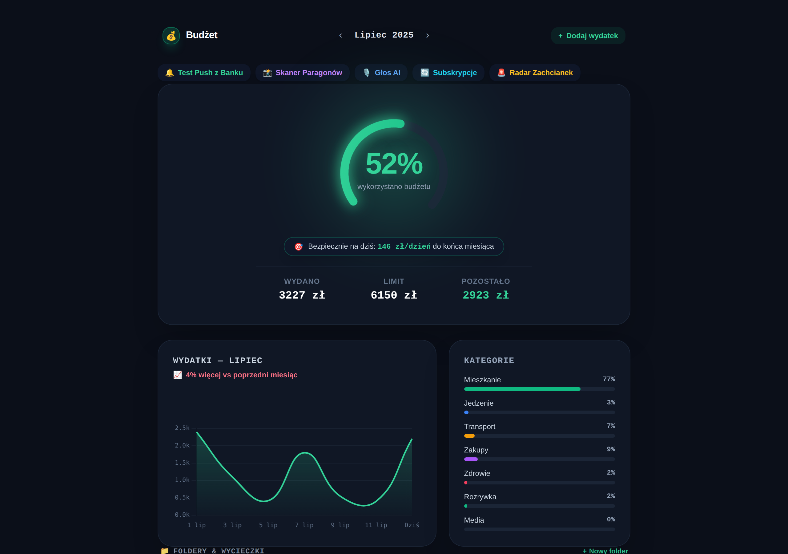
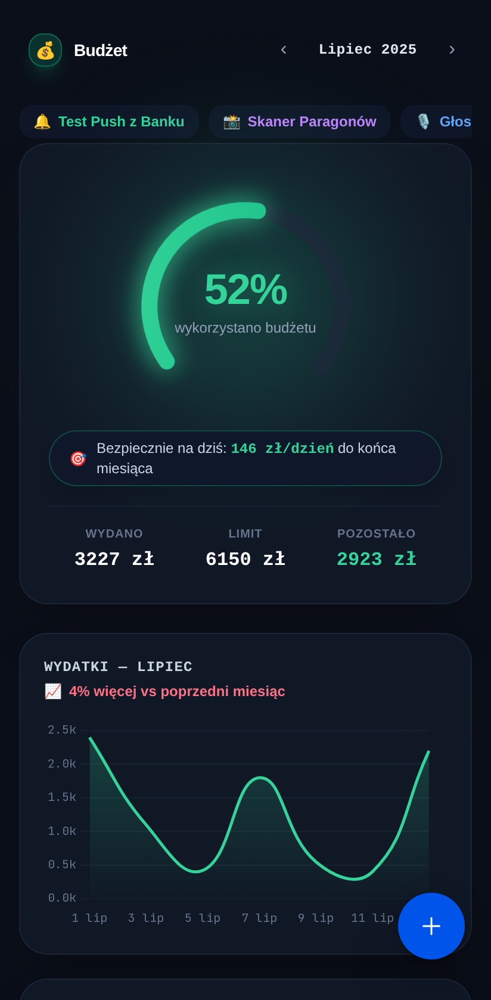
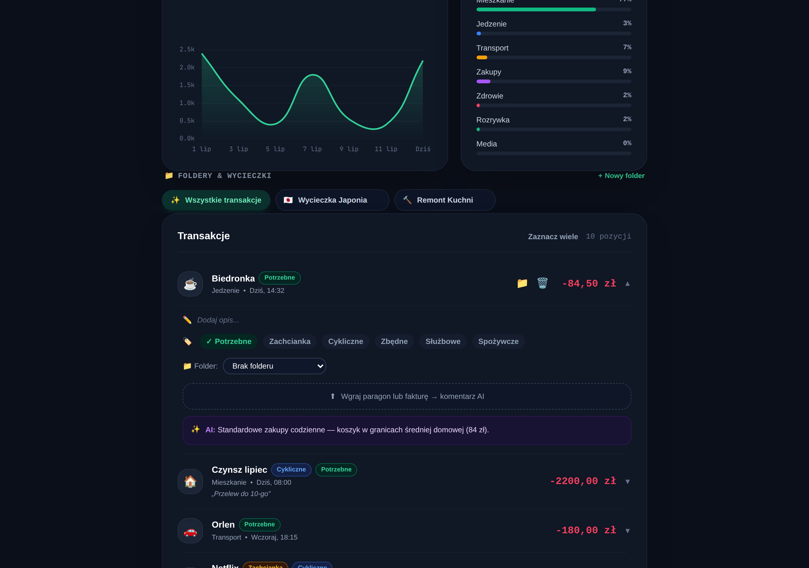
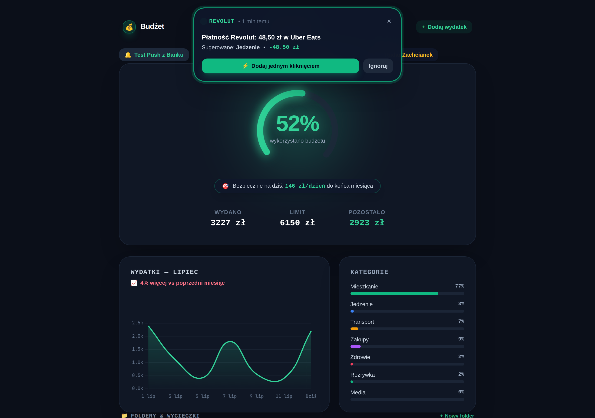
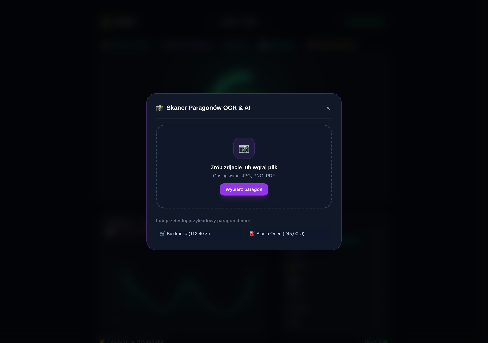
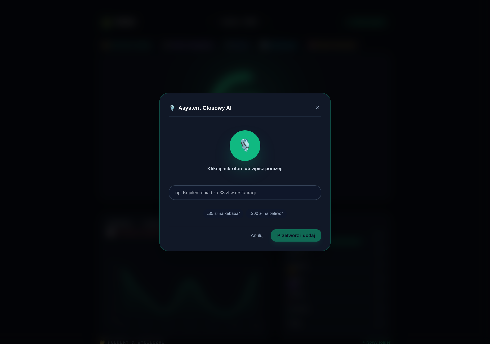
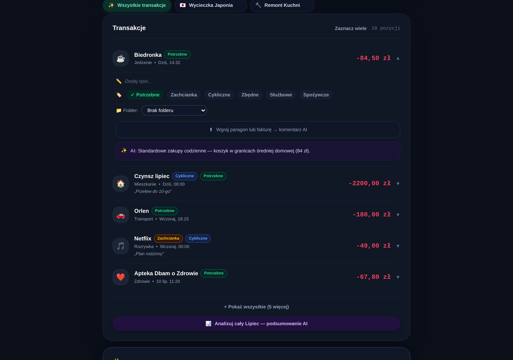
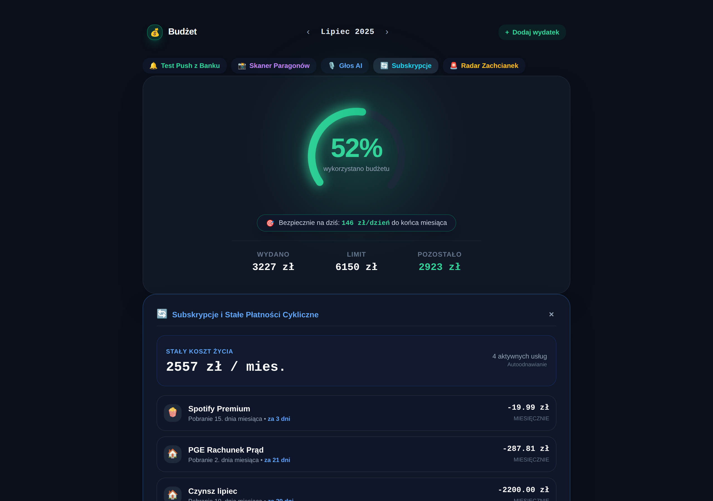
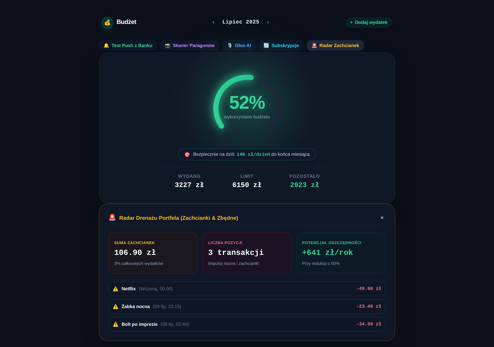

# 📜 PROJECT TESTAMENT — BudżetApp: Architektura, Wizja i Przekazanie Projektu

> **Dla przyszłego Modelu AI / Inżyniera Oprogramowania przejmującego ten projekt:**  
> Ten dokument stanowi **ostateczny testament architektoniczny i produktowy** aplikacji **BudżetApp**.  
> Zawiera on nienaruszalne zasady projektowe, uzasadnienie biznesowo-psychologiczne, mapę techniczną kodu oraz zrzuty ekranu wszystkich kluczowych widoków wygenerowane przez Playwright.  
> **Przeczytaj ten dokument w całości przed napisaniem choćby jednej linii kodu.**

---

## 🧭 1. Manifest Produktu: Dlaczego ta aplikacja istnieje?

### Problem rynku (Dlaczego Wallet by BudgetBakers, Spendee i YNAB zawodzą):
Większość aplikacji do zarządzania finansami na rynku to **przeładowane arkusze kalkulacyjne ubrane w interfejs mobilny**. Wymagają żmudnego, ręcznego wklepywania każdego zakupu, zarzucają użytkownika setkami wykresów i wywołują poczucie winy.

### Efekt porażki psychologicznej („What-the-Hell Effect”):
Gdy użytkownik kupi bilet na wymarzony urlop (*np. Japonia za 4 000 zł*) albo prezent ślubny, tradycyjna aplikacja krzyczy na czerwono: **„PRZEKROCZYŁEŚ BUDŻET O 250%!”**.
W tym momencie mózg użytkownika odbiera to jako porażkę: *„I tak wszystko zepsułem, to po co mam pilnować codziennych obiadów?”* — i po 2 tygodniach aplikacja ląduje w koszu.

### Rozwiązanie BudżetApp:
1. **Zasada 1 Sekundy (Cognitive Ease):** Wchodzisz do aplikacji i w ułamku sekundy wiesz, czy jesteś bezpieczny — bez analizowania tabelek.
2. **Święta Izolacja: Codzienne Życie vs Wyjątkowe Okazje:**
   * **Codzienny styl życia:** Jedzenie, paliwo, czynsz, kawa. To ten wskaźnik decyduje, czy żyjesz ponad stan.
   * **Okazje i Projekty (Wycieczka Japonia 🇯🇵, Remont 🔨, Prezenty 🎁):** Mają osobną pulę oszczędnościową i **NIGDY nie zapalają fałszywego czerwonego alarmu na codziennym łuku**.
3. **Autopilot (Zero-Friction Ingestion):** Użytkownik poświęca maksymalnie **5 sekund dziennie** (dymek push z banku ➡️ jedno kliknięcie ➡️ zrobione).

---

## 🖼️ 2. Wizualna Galeria Systemu (Zrzuty Ekranu z Playwright)

Wszystkie poniższe zrzuty ekranu zostały wygenerowane automatycznie przez silnik **Playwright Chromium**:

### A. Główny Ekran Dashboardu (Desktop & Mobile)
Sercem widoku jest **neonowy łuk procentowy (250°)**, dynamiczny wskaźnik **„Bezpiecznie na dziś” (Safe-to-Spend)**, wykres fali wydatków, paski kategorii oraz rejestr transakcji.

| Widok Desktopowy (1280px) | Widok Mobilny (Google Pixel 7) |
| :---: | :---: |
|  |  |

---

### B. Interaktywny Akordeon Transakcji & Asystent Push z Banku
* **Po lewej:** Rozwinięta transakcja z edycją notatki w locie, interaktywnymi tagami psychologicznymi (`Potrzebne`, `Zachcianka`, `Cykliczne`, `Zbędne`) oraz upuszczeniem paragonu.
* **Po prawej:** Asystent powiadomień bankowych (mBank, Revolut, PKO) z natychmiastowym dodawaniem jednym kliknięciem.

| Rozwinięta Transakcja z Notatką i Tagami | Asystent Powiadomień Bankowych (Push Ingestion) |
| :---: | :---: |
|  |  |

---

### C. Narzędzia AI: Skaner OCR Paragonów & Asystent Głosowy
* **Po lewej:** Multimodalny skaner OCR odczytujący sklep, sumę, pozycje i wykrywający zachcianki.
* **Po prawej:** Asystent mowy NLP parsujący komendy głosowe (np. *„Wydałem 35 zł na obiad”*).

| Skaner Paragonów OCR & AI | Asystent Głosowy NLP |
| :---: | :---: |
|  |  |

---

### D. Analityka Finansowa: Podsumowanie AI, Subskrypcje & Radar Zachcianek
* **Podsumowanie AI:** 4 karty analityczne (*Największy wydatek, Potencjalnie zbędne, Dobra wiadomość, Rekomendacja*).
* **Subskrypcje:** Oś czasu stałych kosztów życia i nadchodzących odnowień.
* **Radar Zachcianek:** Agregacja impulsów i kalkulator rocznych oszczędności przy redukcji o 50%.

| Podsumowanie Miesiąca AI (4 Karty) |
| :---: |
|  |

| Oś Czasu Subskrypcji | Radar Drenażu Portfela & Oszczędności |
| :---: | :---: |
|  |  |

---

## 💻 3. Architektura Technologiczna (Tech Stack)

```
                     +---------------------------------------+
                     |    Angular 19 (Standalone UI)         |
                     |  Signals Store (Zero-Boilerplate)     |
                     |  Tailwind CSS + Ionic 8 WebComponents|
                     +---------------------------------------+
                                         |
                       [Capacitor 8 Mobile Native Bridge]
                                         |
            +----------------------------+----------------------------+
            |                                                         |
            v                                                         v
   [Android APK Platform]                                     [Web / PWA Platform]
   • Haptics Vibrations                                       • LocalStorage Engine
   • Safe Area Insets                                         • Desktop Mouse Gestures
   • Target: NotificationListenerService                      • Playwright E2E Suite
```

### Podstawowe biblioteki i wersje:
* **Framework:** `Angular 19.2.0` (komponenty w 100% standalone, bez `NgModules`).
* **Reaktywność:** `Angular Signals` (`signal()`, `computed()`) — natywna, ultra-szybka reaktywność.
* **Warstwa Mobilna:** `Ionic Framework 8.8.18` (`ion-content`, `ion-refresher`, `ion-item-sliding`).
* **Runtime Natywny:** `Capacitor 8.5.0` (skonfigurowany katalog `/android` z obsługą Gradle).
* **Wizualizacje:** `Chart.js 4.5.1` (fala trendu) + `Custom SVG` (łuk 250°).
* **Testy Automatyczne:** `@playwright/test 1.62.1` (`playwright.config.ts`, testy desktop i mobile).

---

## 📂 4. Mapa Kodu Źródłowego (Directory Structure)

```
src/app/
├── core/
│   ├── models/
│   │   └── budget-app.model.ts      # Definicje typów: Transaction, MonthData, Folder, Tags, Categories
│   └── services/
│       └── budget-state.service.ts  # Mózg aplikacji: Signals Store, LocalStorage, obliczenia Safe-to-Spend
└── features/
    └── budget-app/
        ├── budget-main.component.ts           # Główny kontener widoku, nagłówek z miesiącami i paskami akcji
        ├── budget-hero-gauge.component.ts     # Świecący łuk 250° + Safe-to-Spend + 3 wskaźniki (Wydano/Limit/Pozostało)
        ├── budget-trend-chart.component.ts    # Fala trendu Chart.js (WYDATKI — LIPIEC) z porównaniem do poprz. m-ca
        ├── budget-categories.component.ts     # Paski postępu kategorii (Mieszkanie 68%, Jedzenie 4%...)
        ├── budget-folders-bar.component.ts    # Pozioma karuzela folderów (Wszystkie, Japonia, Remont...)
        ├── budget-transactions.component.ts   # Rejestr transakcji ze swipe (usuń/folderuj) i long-press (multi-select)
        ├── budget-ai-summary.component.ts     # 4 karty analityczne podsumowania AI
        ├── budget-bank-simulator.component.ts # Pływający dymek push z banku z natychmiastowym dodawaniem
        ├── budget-radar-waste.component.ts    # Radar zachcianek i kalkulator rocznych oszczędności
        ├── budget-subscriptions.component.ts  # Oś czasu subskrypcji i stałych kosztów życia
        ├── budget-scanner-modal.component.ts  # Modal skanera paragonów OCR z symulacją i pozycjami
        ├── budget-voice-modal.component.ts    # Modal asystenta głosowego z pulsującym mikrofonem
        ├── budget-add-modal.component.ts      # Szybki formularz dodawania nowego wydatku
        └── budget-create-folder-modal.component.ts # Kreator nowego folderu z selektorem emoji
```

---

## 🏛️ 5. Zasada Czystej Architektury (DIP & Mock Points)

Aplikacja została zaprojektowana zgodnie z **Zasadą Odwrócenia Zależności (DIP)**:
1. **Obecny stan:** Serwis [`budget-state.service.ts`](file:///home/daniel-janowski/workspace/projects/cost-management-app/src/app/core/services/budget-state.service.ts) przechowuje dane w `LocalStorage` pod kluczem `budzetapp_v2_data`.
2. **Podłączenie Produkcyjnego Backend:**
   * **Żaden komponent widoku nie wymaga zmian!**
   * Zmianie ulegają wyłącznie 2 metody w `budget-state.service.ts`:
     * `loadFromStorage()` ➡️ zamiana na `HttpClient.get<MonthData[]>('/api/v1/months')`
     * `persist()` ➡️ zamiana na `HttpClient.post('/api/v1/transactions', payload)`

### Zalecany Stack Backendowy i AI:
* **Brama AI:** **Google Gemini 1.5 Flash (lub 2.0 Flash)** przez [Google AI Studio](https://aistudio.google.com/) lub Vertex AI (region Warszawa `europe-central2`).
* **Backend:** FastAPI (Python) lub NestJS (TypeScript) w kontenerze Docker.
* **Baza:** PostgreSQL + S3/Cloudflare R2 na zdjęcia paragonów.

---

## 🛠️ 6. Przewodnik CLI dla Inżyniera

```bash
# 1. Uruchomienie lokalnego serwera deweloperskiego
npm start

# 2. Uruchomienie testów Playwright E2E (w tle)
npm run test:e2e

# 3. Interaktywne UI Playwrighta z Time-Travel Debuggerem
npm run test:e2e:ui

# 4. Ponowne wygenerowanie wszystkich zrzutów ekranu do dokumentacji
node scripts/capture-screenshots.js

# 5. Synchronizacja zasobów z projektem Android Capacitor
npm run cap:sync

# 6. Otwarcie projektu w Android Studio (do wygenerowania pliku APK)
npm run cap:android

# 7. Bezpośrednie zbudowanie Debug APK przez Gradle w terminalu
npm run cap:build:apk
```

---

## ⚠️ 7. Nienaruszalne Przykazania dla Przyszłych Modelów AI

1. **NIGDY nie zmieniaj tej aplikacji w suchy arkusz Excela.** Jeśli funkcja wymaga 10 dodatkowych kliknięć, odrzuć ją.
2. **NIGDY nie pozwól, by planowany wydatek okazjonalny (np. wakacje w Japonii) zapalił czerwony alarm na codziennym łuku.** Zawsze izoluj wycieczki i prezenty do osobnej puli.
3. **Szanuj uwagę użytkownika.** Wskaźnik `🎯 Bezpiecznie na dziś: X zł/dzień` ma być natychmiast widoczny i zrozumiały w 1 sekundę.
4. **Utrzymuj 100% zgodność z Capacitor Android.** Każda zmiana w kodzie webowym musi kompilować się bezbłędnie przez `npm run cap:sync`.
