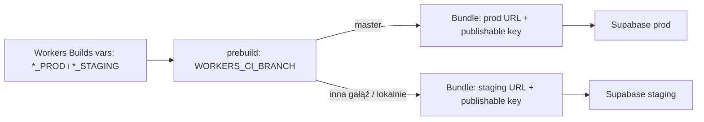

# Plan pierwszego wdrożenia: Cloudflare Workers (static assets) + fundament Supabase

> **Zmiana platformy (2026-10-03):** panel Cloudflare kieruje nowe projekty do Workers, a nie do Pages. Wdrażamy więc statyczną aplikację jako **Cloudflare Workers z static assets i Workers Builds** połączonym z GitHubem. Konfiguracja jest w repozytorium (`wrangler.jsonc`), a nie w formularzu. Nie ma skryptu Workera, więc nie ma też runtime serwerowego. Miejsca, w których dalej w tym dokumencie pojawia się „Pages”, odnoszą się teraz do tego projektu Workers. Rozdzielenie zmiennych Production i Preview (Etap 2) trzeba potwierdzić w ustawieniach Workers Builds.

## Cel i zakres

Wdrożyć obecną aplikację webową jako publiczne demo na Cloudflare Workers (static assets), z repozytorium GitHub jako źródłem wdrożeń. **Od pierwszego wdrożenia uruchamiamy też Supabase i podpinamy go do projektu**: projekty staging i prod, Auth, wersjonowane migracje, klient w aplikacji, konfigurację buildu i przełącznik źródła danych.

Aplikacja nadal zapisuje dane w LocalStorage, dopóki przełącznik `DATA_BACKEND` ma wartość `local`. Fizyczne przejście na Supabase polega później na dodaniu schematu i adapterów repozytoriów, a następnie zmianie przełącznika na `supabase`. Nie wymaga przebudowy infrastruktury, buildu ani komponentów.

Ten dokument rozwija rekomendację z [oceny infrastruktury](../foundation/infrastructure.md) i opiera się na stosie opisanym w [ocenie stacku](../foundation/stack-assessment.md). Nie ma osobnego `tech-stack.md`; wersje zależności i komendy należy sprawdzać w `package.json` oraz `package-lock.json`. Fazy implementacyjne odnoszą się do planu [stabilize-and-supabase-mvp](../changes/stabilize-and-supabase-mvp/change.md). Termin MVP to 2026-11-04, dlatego problemy z konfiguracją, środowiskami i przekierowaniami Auth mają wyjść na jaw teraz, a nie w ostatnim tygodniu.

Plan nie obejmuje własnej domeny, wydania aplikacji mobilnej ani CI. Połączenie GitHub–Cloudflare uruchamia automatyczne wdrożenia, ale nie uruchamia testów.

## Co znaczy „przygotowane”, a co „przełączone”

| Element | Od pierwszego wdrożenia | Przy przełączeniu na Supabase |
|---|---|---|
| Projekty `portfel-staging` i `portfel-prod` | Utworzone, Auth URL Configuration ustawione | Bez zmian |
| Katalog `supabase/` w repo, lokalny Supabase | `supabase init`, `config.toml`, lokalny stack do developmentu | Bez zmian |
| Migracje | Migracja bazowa bez tabel użytkownika, wdrożona na staging i prod przez CLI | Migracje tabel, constraintów i RLS dla docelowego kontraktu |
| Klient `@supabase/supabase-js` | Zależność, provider klienta w `src/app/core/`, konfiguracja z buildu | Bez zmian |
| Konfiguracja buildu | Skrypt generujący konfigurację z `SUPABASE_URL`, `SUPABASE_PUBLISHABLE_KEY`, `DATA_BACKEND` | Bez zmian |
| Repozytoria | Kontrakty w `src/app/core/repositories/`, aktywny adapter LocalStorage, testy kontraktowe | Adapter Supabase przechodzi te same testy kontraktowe |
| `DATA_BACKEND` | `local` w Production i Preview | Najpierw `supabase` w Preview (staging), potem w Production |
| Auth w UI | Brak ekranów logowania | Rejestracja, logowanie, ochrona tras |

## Ocena i korekty rekomendacji infrastruktury

Zachowujemy Cloudflare Pages, integrację z GitHubem, jawny katalog wynikowy `dist/cost-management-app/browser`, podglądy branchy, ograniczone uprawnienia i osobny proces cofania zmian webowych.

Pierwotny plan wymagał następujących doprecyzowań:

- **Sposób wdrażania:** Workers Builds połączony z GitHubem. Build `npm run build`, deploy `npx wrangler deploy`. Wrangler jest przypięty w `devDependencies`, więc lokalnie i w Cloudflare działa ta sama wersja. Lokalny podgląd: `npx wrangler dev`.
- **Katalog buildu i SPA:** `wrangler.jsonc` jawnie ustawia `assets.directory` na `./dist/cost-management-app/browser` oraz `not_found_handling: "single-page-application"`, więc bezpośrednie trasy Angulara zwracają `index.html`. Bez automatycznego wykrywania.
- **Token API:** Workers Builds tworzy token, którym wdraża projekt. Nazwać go jednoznacznie (np. `workers-builds-portfel-bez-spiny`) i nie używać go nigdzie indziej. Nie tworzyć osobnych tokenów dla agentów.
- **Backend:** Supabase jest uruchamiany i podpinany od początku, ale dane aplikacji pozostają w LocalStorage do czasu przełączenia. Supabase jest wybranym backendem MVP według PRD.
- **Warstwa danych:** główny ekran z Safe-to-Spend korzysta z `BudgetStateService`, który dziś czyta i zapisuje `localStorage` bezpośrednio, bez repozytorium. Istniejące `ExpenseRepository` i `BudgetRepository` obsługują starszy, prototypowy model. Bez repozytorium pod głównym przepływem płynne przełączenie nie jest możliwe, dlatego plan obejmuje je od razu (Etap 4).
- **Dostępność:** publiczne demo z `noindex`. `noindex` ogranicza indeksowanie, nie dostęp.
- **Testy i zależności:** health check wskazywał niekompilujący się test jednostkowy, nieudany test Mobile Pixel i podatne zależności. Przed wydaniem trzeba sprawdzić bieżący stan, naprawić oba testy i podjąć decyzję o wynikach audytu.
- **Brak CI:** do czasu dodania CI lokalne testy są obowiązkową bramką przed każdym pushem na `master`.
- **Konfiguracja npm:** `.npmrc` zawiera `strict-ssl=false`. Usunąć albo zastąpić udokumentowaną konfiguracją zaufanego certyfikatu.
- **Wersja Node:** repozytorium nie przypina wersji. Ustalić wspieraną wersję (lokalnie Node 22), zapisać ją w `.nvmrc` i ustawić `NODE_VERSION` w Cloudflare. Potwierdzić w logu buildu.
- **SPA i nagłówki:** sprawdzić odświeżanie bezpośrednich tras na Pages. Regułę `/* /index.html 200` w `public/_redirects` dodać tylko wtedy, gdy domyślny fallback nie wystarczy. Nagłówki ustawić przez `public/_headers`.

Docelowe nagłówki dla publicznego demo:

```text
/*
  X-Robots-Tag: noindex
  X-Content-Type-Options: nosniff
  Referrer-Policy: strict-origin-when-cross-origin
  X-Frame-Options: DENY
```

Nie dodawać Content Security Policy bez osobnego sprawdzenia zasobów aplikacji. Po włączeniu Supabase CSP musiałaby dopuszczać domeny projektów Supabase w `connect-src`.

## Wymagania wstępne

### Konta i dostęp

- **GitHub:** dostęp pozwalający autoryzować Cloudflare GitHub App dla `JNDaniel/portfel-bez-spiny`. Repozytorium istnieje, a `master` śledzi `origin/master`.
- **Cloudflare:** konto z dostępem do Workers & Pages. GitHub App ograniczona do tego repozytorium, jeśli panel na to pozwala.
- **Supabase:** konto i organizacja z ustalonym właścicielem rozliczeń i odzyskiwania dostępu. Dwa projekty: `portfel-staging` dla preview i developmentu oraz `portfel-prod`. Wspólny region wybrany przed utworzeniem projektów.
- **Plan Supabase:** wybrany po sprawdzeniu limitów, kosztów, pauzowania nieaktywnych projektów i kopii zapasowych. Projekt prod bez ruchu do czasu przełączenia może zostać wstrzymany w planie Free; przed przełączeniem trzeba go wznowić albo zmienić plan. Plan Free nie daje kopii zapasowych odpowiednich dla danych produkcyjnych.
- **Menedżer haseł:** hasła do kont, hasła baz danych, recovery codes i ewentualny access token Supabase CLI. Nic z tego nie trafia do repozytorium.

### Narzędzia lokalne

- Node.js w przypiętej wersji, npm i instalacja z lockfile przez `npm ci`.
- Supabase CLI jako zależność deweloperska projektu (`npx supabase ...`), żeby lokalnie i w przyszłym CI używać tej samej wersji.
- Docker do uruchamiania lokalnego Supabase (`supabase start`).
- Naprawiony lokalny zestaw testów: build, testy jednostkowe i E2E, w tym Mobile Pixel.

### Decyzje przed startem

- `master` jest branchem produkcyjnym, a jego pierwszy build po podłączeniu Pages publikuje publiczny serwis.
- Demo nie zawiera sekretów, prywatnych danych ani treści, które nie powinny być publiczne.
- Sposób usunięcia lub zastąpienia `strict-ssl=false`.
- Docelowy kontrakt domenowy dla głównego przepływu (faza 4) jest uzgodniony przed tworzeniem tabel użytkownika.

### Poza zakresem pierwszego wdrożenia

- GitHub CLI (`gh`), lokalny Wrangler jako zależność, własna domena, Cloudflare API token, Pages Functions i Workers.
- Migracja danych demonstracyjnych z LocalStorage do Supabase; PRD jej nie wymaga.
- Ekrany logowania i fizyczne zapisywanie danych użytkownika w Supabase.

## Etap 0: przygotować i zweryfikować repozytorium

Nie podłączać jeszcze repozytorium do Pages. Najpierw:

1. Sprawdzić `git status`, branch produkcyjny i zawartość commita, który Cloudflare miałby wdrożyć.
2. Naprawić nieaktualne asercje testu jednostkowego oraz przyczynę niepowodzenia mobilnego testu dodawania wydatku.
3. Sprawdzić aktualny `npm audit`. Nie używać `npm audit fix --force`. Zaakceptowane na czas demo ryzyka zapisać z zakresem, uzasadnieniem i terminem ponownej oceny.
4. Usunąć `strict-ssl=false` albo zastąpić go konfiguracją zaufanego certyfikatu. Zweryfikować `npm ci` z normalną weryfikacją TLS.
5. Przypiąć wersję Node w `.nvmrc`.
6. Dodać `public/_headers`, a `public/_redirects` tylko jeśli będzie potrzebny. Sprawdzić, że oba pliki trafiają do `dist/cost-management-app/browser`.
7. Uruchomić z czystej instalacji:

   ```bash
   npm ci
   npm run build
   npm test -- --watch=false
   npm run test:e2e
   ```

8. Opcjonalnie sprawdzić statyczny serwis lokalnie:

   ```bash
   npx wrangler dev
   ```

9. Przy zmianach UI, pluginów Capacitor lub konfiguracji natywnej uruchomić `npm run cap:build:apk` zgodnie z `AGENTS.md`.

**Bramka:** nie podłączać `master` do automatycznego wdrażania, dopóki build, testy i decyzja o podatnościach nie są zakończone.

### Decyzja o podatnościach dla pierwszego wdrożenia (2026-10-03)

- `npm audit` z 2026-10-03: 59 wyników (2 critical, 40 high, 15 moderate, 2 low). W zależnościach runtime (`--omit=dev`) jest 7 wyników, wszystkie w pakietach `@angular/*` 19.2.
- Pozostałe wyniki dotyczą narzędzi buildu i testów (Angular CLI/devkit, Karma, Capacitor CLI), które nie trafiają do przeglądarki.
- Wszystkie poprawki wymagają przejścia na Angular 21, czyli fazy 2 planu `stabilize-and-supabase-mvp`.
- **Decyzja właściciela projektu:** akceptujemy to ryzyko dla publicznego, statycznego demo bez danych użytkowników. Aplikacja nie używa SSR, `HttpTransferCache` ani i18n, których dotyczą zgłoszone podatności runtime.
- **Termin ponownej oceny:** przed przełączeniem `DATA_BACKEND=supabase` w Production. Upgrade Angulara musi zostać zakończony przed zapisem prawdziwych danych użytkowników.

## Etap 1: utworzyć projekt Cloudflare Workers połączony z GitHubem

Przed tym etapem wszystkie commity muszą być na `origin/master`, bo Cloudflare buduje kod z GitHuba. Wykonuje właściciel konta w panelu Cloudflare:

1. **Compute → Workers & Pages → Create application → Import a repository** (nazwy w panelu mogą się zmienić).
2. Autoryzować GitHub App tylko dla potrzebnego repozytorium i wybrać `JNDaniel/portfel-bez-spiny`.
3. Ustawienia:
   - Project name: `portfel-bez-spiny`; musi być zgodny z `name` w `wrangler.jsonc`.
   - Build command: `npm run build`.
   - Deploy command: `npx wrangler deploy`.
   - Preview command: `npx wrangler versions upload`; tworzy wersję podglądową bez publikacji na produkcji.
   - Enable Preview builds: włączone. Protect with Cloudflare Access: na razie wyłączone, bo demo jest publiczne.
   - Path: `/`.
   - API token: utworzyć nowy, nazwany jednoznacznie, np. `workers-builds-portfel-bez-spiny`.
   - Build variables: `NODE_VERSION=22` i `DATA_BACKEND=local`. Zmienne Supabase dodajemy w Etapie 2.
4. Branch produkcyjny ustawia się po utworzeniu projektu: **Settings → Build → Branch control**. Ustawić `master`.
5. Pierwszy udany build `master` jest wdrożeniem produkcyjnym pod adresem `https://portfel-bez-spiny.<subdomena-konta>.workers.dev`.

**Stan (2026-10-03):** wykonane. Produkcja: `https://portfel-bez-spiny.themantax.workers.dev`. Smoke test: `/`, `/dashboard`, `/expenses`, `/settings` i nieznana ścieżka zwracają 200 z aplikacją; nagłówki `X-Robots-Tag: noindex`, `nosniff`, `Referrer-Policy` i `X-Frame-Options: DENY` są obecne.

## Etap 2: uruchomić projekty Supabase i Auth

Wykonać po utworzeniu projektu Workers, gdy znany jest host produkcyjny. Dla stagingu wybrać stabilny host preview, czyli alias gałęzi `staging`: `https://staging-portfel-bez-spiny.themantax.workers.dev` (wymaga włączonych Preview URLs w Settings → Domains & Routes).

1. Utworzyć projekty `portfel-staging` i `portfel-prod` w tym samym regionie. Hasła baz danych zapisać w menedżerze haseł.
2. Zanotować Project URL, project ref i publishable key każdego projektu. Publishable key jest przeznaczony dla klienta i nie jest sekretem. Klucze `secret` i legacy `service_role` nigdy nie trafiają do przeglądarki, repozytorium, zmiennych buildu ani artefaktów.
3. Auth → URL Configuration:
   - **prod:** Site URL `https://portfel-bez-spiny.<subdomena-konta>.workers.dev`. Redirect allow list tylko dla tego hosta i potrzebnych ścieżek.
   - **staging:** Site URL na stabilny host preview. Redirect allow list obejmuje ten host oraz `http://localhost:4200/**` do lokalnego developmentu.
   - Jeśli logowanie na hash-based preview URL-ach będzie potrzebne, dodać wzorzec ograniczony do subdomen tego projektu Pages, wyłącznie w stagingu. Składnię potwierdzić w dokumentacji Supabase. Nigdy nie dodawać wildcardu w prod.
4. Auth → Providers: zostawić email i hasło zgodnie z PRD. Pozostałych providerów nie włączać.
5. Workers Builds ma jeden zestaw zmiennych buildu dla wszystkich gałęzi, bez podziału Production/Preview. Dlatego w **Settings → Build → Variables and secrets** dodać cztery zmienne:
   - `SUPABASE_URL_PROD`, `SUPABASE_PUBLISHABLE_KEY_PROD` z `portfel-prod`;
   - `SUPABASE_URL_STAGING`, `SUPABASE_PUBLISHABLE_KEY_STAGING` z `portfel-staging`.

   Skrypt prebuild (Etap 4) wybiera zestaw prod tylko gdy `WORKERS_CI_BRANCH=master`; każda inna gałąź i build lokalny dostają staging. To wartości publiczne przeznaczone dla klienta. Test w Etapie 4 sprawdza, że build gałęzi innej niż `master` nie zawiera hosta prod.

6. Nie tworzyć tabel ani polityk ręcznie w panelu. Każda zmiana schematu przechodzi przez migracje w repozytorium.

## Etap 3: Supabase w repozytorium

1. Dodać Supabase CLI jako zależność deweloperską i zainicjować projekt:

   ```bash
   npm install --save-dev supabase
   npx supabase init
   ```

   Commitować `supabase/config.toml` i `supabase/migrations/`. Pliki lokalne i tymczasowe CLI dopisać do `.gitignore`.

2. Uruchomić lokalny stack i sprawdzić, że działa:

   ```bash
   npx supabase start
   npx supabase status
   ```

   Lokalny URL i publishable key służą tylko do developmentu i testów; nie są konfiguracją żadnego środowiska zdalnego.

3. Utworzyć migrację bazową bez tabel użytkownika, np. wspólną funkcję `set_updated_at()` do przyszłych triggerów. Jej celem jest sprawdzenie całej ścieżki migracji, a nie model danych:

   ```bash
   npx supabase migration new baseline
   npx supabase db reset
   ```

4. Wdrożyć migrację bazową najpierw na staging, potem na prod:

   ```bash
   npx supabase link --project-ref <staging-ref>
   npx supabase db push
   npx supabase link --project-ref <prod-ref>
   npx supabase db push
   ```

   Push na prod wymaga akceptacji człowieka. Agent nie dostaje stałego dostępu do bazy produkcyjnej.

5. `supabase/seed.sql` może zawierać wyłącznie lokalne dane testowe. Nigdy dane osobowe ani poświadczenia.
**Stan (2026-10-03):** kroki 1–4 wykonane. Supabase CLI 2.119.0, migracja `20261003202153_baseline.sql` (`public.set_updated_at()`) zastosowana lokalnie, na stagingu (`zkiopvcinvhzsqemypev`) i na prod (`ziscthkrauzpadcznuaq`, push wykonał właściciel). Lokalny `link` wskazuje domyślnie staging.

6. Tabele `monthly_budgets`, `expense_folders`, `expenses`, constrainty i RLS dodajemy w fazie 5, po zamrożeniu kontraktu w fazie 4. Od tego momentu każda tabela użytkownika ma włączone RLS w tej samej migracji, w której powstaje.

## Etap 4: podpiąć Supabase w aplikacji

Ten etap wprowadza kod, ale nie zmienia zachowania aplikacji, dopóki `DATA_BACKEND=local`.

### Konfiguracja buildu

- Skrypt `prebuild` generuje plik konfiguracyjny ignorowany przez Git, np. `src/environments/runtime-config.generated.ts`, z `DATA_BACKEND`, `SUPABASE_URL` i `SUPABASE_PUBLISHABLE_KEY`.
- Brak `DATA_BACKEND` oznacza `local`. Przy `DATA_BACKEND=supabase` brak URL lub klucza przerywa build z czytelnym błędem; build nie może po cichu użyć innego projektu.
- Lokalnie wartości pochodzą z `.env` (ignorowany przez Git) z szablonem `.env.example` bez prawdziwych wartości.
- Po buildzie skrypt sprawdza bundle pod kątem `sb_secret_`, `service_role` i innych uprzywilejowanych kluczy. Wykrycie przerywa build.



**Stan (2026-10-03):** konfiguracja buildu i klient wykonane. `scripts/generate-runtime-config.mjs` (hooki `prebuild`, `prestart`, `pretest`, `prewatch`) generuje `src/environments/runtime-config.generated.ts`; odrzuca nieznany `DATA_BACKEND`, klucz inny niż `sb_publishable_` i brak wartości przy `supabase`. `scripts/scan-bundle-secrets.mjs` (`postbuild`) przerywa build przy `sb_secret_`, `service_role` lub JWT z rolą `service_role`. `SupabaseClientService` ładuje `@supabase/supabase-js` dynamicznym importem tylko przy `DATA_BACKEND=supabase`. Repozytorium pod głównym przepływem czeka na decyzję o kontrakcie.

### Klient i granica repozytoriów

- Dodać `@supabase/supabase-js`.
- W `src/app/core/` dodać provider klienta Supabase (np. `InjectionToken`), tworzący klienta leniwie i tylko przy `DATA_BACKEND=supabase`. Przy `local` aplikacja nie wysyła żadnych żądań do Supabase.
- Komponenty nie importują klienta Supabase ani nie używają `localStorage` do danych użytkownika. Dostęp mają tylko implementacje repozytoriów, zgodnie z `AGENTS.md`.

### Repozytorium pod głównym przepływem

- Zdefiniować kontrakt repozytorium dla docelowego modelu z fazy 4: budżet miesięczny, wydatki z klasyfikacją `everyday | occasional | want`, foldery, kwoty w groszach z walutą.
- API repozytorium jest asynchroniczne (Observable lub Promise) już przy adapterze LocalStorage. Dzięki temu przejście na sieć nie zmienia komponentów.
- Pierwszą implementacją jest adapter LocalStorage. `BudgetStateService` przestaje odczytywać i zapisywać `localStorage` bezpośrednio i korzysta wyłącznie z repozytorium.
- Wybór implementacji odbywa się w jednym miejscu, w providerach `app.config.ts`, na podstawie `DATA_BACKEND`. Zastępuje to przełączanie implementacji wewnątrz poszczególnych serwisów.
- Testy kontraktowe uruchamiane na każdej implementacji repozytorium. Adapter Supabase w fazie 7 musi przejść te same testy.
- Obliczenia Safe-to-Spend pozostają w jednej przetestowanej warstwie domenowej i nie zależą od źródła danych. Wydatki `occasional` nigdy nie wpływają na stan ostrzeżenia dziennego budżetu.
- `SettingsService` i `ThemeService` mogą dalej używać `localStorage`, bo przechowują preferencje urządzenia, a nie dane użytkownika.

Walidacja tego etapu: build, testy jednostkowe (w tym kontraktowe), pełne E2E desktop i Mobile Pixel, `npm run cap:build:apk` oraz skan bundla. Zachowanie aplikacji ma być identyczne jak przed zmianą.

## Etap 5: smoke test pierwszego wdrożenia

Na adresie `*.workers.dev`:

- Strona główna przekierowuje do `/dashboard`.
- `/dashboard`, `/expenses`, `/budgets`, `/analytics` i `/settings` otwierają się bezpośrednio i po odświeżeniu nie zwracają 404.
- Na desktopie i Pixel 7 Safe-to-Spend i jego ostrzeżenie są widoczne bez przewijania.
- Dane demonstracyjne są lokalne dla przeglądarki i nie są przedstawiane jako prywatne konto.
- Odpowiedź HTTP zawiera `X-Robots-Tag: noindex` i pozostałe nagłówki.
- Log buildu pokazuje oczekiwaną wersję Node, katalog wyjściowy, uruchomiony `prebuild` i udany skan bundla.
- W narzędziach deweloperskich przeglądarki brak żądań do Supabase przy `DATA_BACKEND=local`.
- Bundle Production zawiera wyłącznie URL i publishable key projektu prod, a bundle Preview wyłącznie dane stagingu.
- Migracja bazowa jest widoczna w historii migracji obu projektów (`npx supabase migration list`).
- Auth URL Configuration obu projektów wskazuje właściwe hosty.

Testu logowania jeszcze nie wykonujemy, bo aplikacja nie ma ekranów Auth.

## Etap 6: przełączenie na Supabase (później, fazy 5–8)

Infrastruktura i podpięcie z Etapów 2–4 pozostają bez zmian. Przełączenie obejmuje:

1. Migracje tabel użytkownika, constraintów i RLS z politykami `auth.uid() = user_id` oraz testy izolacji dwóch użytkowników. Kolejność: lokalnie, staging, prod po akceptacji.
2. Rejestrację, logowanie, przywracanie sesji i ochronę tras.
3. Adapter Supabase repozytorium, który przechodzi testy kontraktowe.
4. `DATA_BACKEND=supabase` najpierw w Preview (staging) i E2E na stabilnym hoście preview, w tym test logowania i przekierowań.
5. Wznowienie projektu prod, jeśli był wstrzymany, oraz decyzja o kopiach zapasowych przed zapisem prawdziwych danych.
6. `DATA_BACKEND=supabase` w Production, nowe wdrożenie i smoke test logowania na produkcji.

Powrót do `local` jest możliwy przez zmianę zmiennej i ponowne wdrożenie, ale dane zapisane w Supabase nie wrócą do LocalStorage. To awaryjne wyłączenie, a nie migracja danych.

## Kolejne wdrożenia i bramki

- Przed każdym pushem do `master` uruchomić lokalnie build, testy jednostkowe i E2E. Rozważyć ochronę `master` przez pull request.
- Dodać CI w osobnym zakresie. Po jego skonfigurowaniu wymagane status checks muszą przechodzić przed merge do `master`, a CI może też sprawdzać `supabase db reset` na lokalnym stacku.
- Przy zmianie output directory, buildera Angulara albo wersji narzędzi ponownie sprawdzić publikowane pliki i deep links.
- Nie dodawać Pages Functions, Workers ani Edge Functions bez nowej oceny kosztów, logowania, sekretów i odpowiedzialności serwerowej.

## Rollback, logi i odpowiedzialność

- Rollback Cloudflare Pages przywraca frontend, ale nie cofa migracji, danych, ustawień Auth ani wydań Capacitor.
- Migracje są zgodne wstecz z poprzednią wersją frontendu. Zmiany niszczące (usuwanie kolumn, zmiana typów) wdrażać w kilku krokach.
- Przy pierwszym wdrożeniu może nie być wcześniejszej wersji do przywrócenia; wtedy wdrożyć commit naprawczy.
- Diagnostyka: build i deployment logs projektu Workers (zakładki Deployments i Builds) oraz logi projektu w panelu Supabase. Statyczna aplikacja nie ma logów serwera; błędy klienta wymagają osobnej obserwowalności.
- Właściciel projektu zatwierdza pierwsze publiczne wdrożenie, migracje na prod, zmianę `DATA_BACKEND` w Production, zmiany domeny/DNS, uprawnień GitHub App i ustawień kont.
- Każda wartość w bundlu Angulara jest publiczna. Do klienta trafiają wyłącznie Project URL i publishable key.

## Ryzyka

| Ryzyko | Ograniczenie |
|---|---|
| Cloudflare publikuje zły katalog mimo udanego buildu | Jawny `dist/cost-management-app/browser` i sprawdzenie zawartości wdrożenia. |
| Push do `master` publikuje nieprzetestowany stan | Lokalne bramki przed pushem; później wymagane status checks w CI. |
| Demo jest publiczne mimo `noindex` | Brak danych prywatnych; `noindex` nie jest autoryzacją. |
| Preview zapisuje dane w projekcie prod | Zmienne Preview wskazują staging, Production wskazuje prod; weryfikacja w smoke teście i skanie bundla. |
| Szeroki wildcard w redirect URLs | Stabilne hosty; wildcard tylko w stagingu i tylko dla subdomen tego projektu Pages. |
| Projekt Free zostaje wstrzymany lub brak kopii zapasowych | Wznowienie i decyzja o planie przed przełączeniem prod; brak prawdziwych danych na planie bez backupu bez świadomej akceptacji. |
| Uprzywilejowany klucz trafia do frontendu | Tylko URL i publishable key w konfiguracji buildu; skan bundla przerywa build. |
| Klient Supabase wysyła żądania przy `DATA_BACKEND=local` | Leniwe tworzenie klienta tylko przy `supabase`; sprawdzenie w smoke teście. |
| Tabele powstają przed zamrożeniem kontraktu | Etap 3 tworzy tylko migrację bazową; tabele dopiero po fazie 4. |
| Ręczne zmiany schematu w panelu rozjeżdżają środowiska | Wszystkie zmiany przez migracje; `supabase migration list` w smoke teście. |
| Refaktor `BudgetStateService` zmienia zachowanie Safe-to-Spend | Testy kontraktowe, testy domenowe i pełne E2E desktop/mobile przed wdrożeniem. |
| Wyłączona weryfikacja TLS w npm | Usunięcie `strict-ssl=false` lub zatwierdzony certyfikat CA. |
| Stare podatności w zależnościach | Ponowny audyt przed wdrożeniem i jawna akceptacja ryzyk. |

## Kryteria zakończenia

- Projekt Pages jest połączony z repozytorium, `master` jest branchem produkcyjnym, a build publikuje `dist/cost-management-app/browser`.
- Build, testy jednostkowe i E2E desktop/mobile przechodzą lokalnie przed wydaniem.
- Trasy, odświeżenia i nagłówki działają na `*.workers.dev`.
- Projekty `portfel-staging` i `portfel-prod` działają, a Auth URL Configuration wskazuje właściwe hosty.
- Repozytorium zawiera `supabase/` z migracją bazową wdrożoną na staging i prod.
- Aplikacja zawiera klienta Supabase, generowaną konfigurację buildu, przełącznik `DATA_BACKEND` i skan bundla.
- Główny przepływ korzysta z repozytorium z aktywnym adapterem LocalStorage i testami kontraktowymi; komponenty i `BudgetStateService` nie używają `localStorage` do danych użytkownika.
- Przy `DATA_BACKEND=local` aplikacja działa jak wcześniej i nie wysyła żądań do Supabase.
- Brak CI i znane ryzyka zależności są jawnie odnotowane.

## Źródła do weryfikacji ustawień

- [Supabase Auth redirect URLs](https://supabase.com/docs/guides/auth/redirect-urls)
- [Supabase API keys](https://supabase.com/docs/guides/getting-started/api-keys)
- [Supabase Free project pausing](https://supabase.com/docs/guides/platform/free-project-pausing)
- [Supabase database backups](https://supabase.com/docs/guides/platform/backups)
- [Cloudflare Pages preview deployments](https://developers.cloudflare.com/pages/configuration/preview-deployments/)
- [Cloudflare Pages build configuration](https://developers.cloudflare.com/pages/configuration/build-configuration/)
